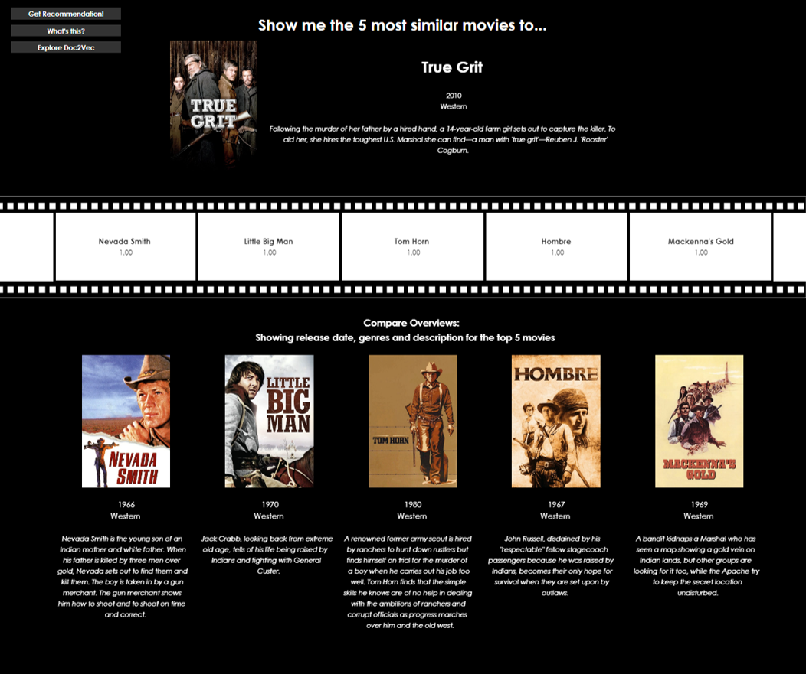

# tableau-movie-recommender
This project takes a classic project - building a simple recommender system to suggest similar movies - and adds a Tablea twist; can we perform similarity scoring on-the-fly in Tableau instead of pre-computing pairwise similarity and storing it in a static dataset? 

There are three key elements to the repo:
1. Using the MovieLens API to fetch more text and image data per movie 
2. Data science transformation techniques (primarily text processing and Doc2Vec)
3. Mimicking matrix calculations in Tableau to compute cosine similarity between movie records, and ensuring this can scale automatically as new attributes are added to the input data.

#### Data Source
The data used for this project covers ~9k movies found in the MovieLens database, stored in data/ml-latest-small/raw/. This sample dataset was generated in 2018 by GroupLens - further information can be found in the original README from that project, a copy of which is stored within the raw folder. Citation foor this dataset:
> F. Maxwell Harper and Joseph A. Konstan. 2015. The MovieLens Datasets: History and Context. ACM Transactions on Interactive Intelligent Systems (TiiS) 5, 4: 19:1–19:19. <https://doi.org/10.1145/2827872>

This set consists of four files - whilst we explore all four, we only use two: movies.csv (includes base information like title, release year and genres, the latter two requiring transformation) and links.csv (includes a reference ID used to fetch further info from the MovieLens API). Ratings.csv and tags.csv contain user-generated information which would have use in a collaborative-filtering based recommendation system (however to date, the recommender in this repo is content-based only).

#### Visualisation
The Tableau dashboard output is kept minimal, with only two pages: the first enables user inpiut and configuration to find the top N recommended movies, based on a chosen movie, whilst the second allows the user to understand Doc2vec in more detail by visualising the way in which different genres show different clustering in 2D space.

By structuring the Tableau data model to focus on 'long', unpivotted data rather than wide, we can ensure that the cosine similarity calculations scale with the number of movie attributes available in the data. In this version, we have release year, 19 genre flags (one-hot encoded), and the Doc2Vec output (100 columns, each treated as a separate feature). This information is all stored in the base attributes table, whilst categorical information to assist the end user is stored in the fact table (e.g. text description in readable form). 